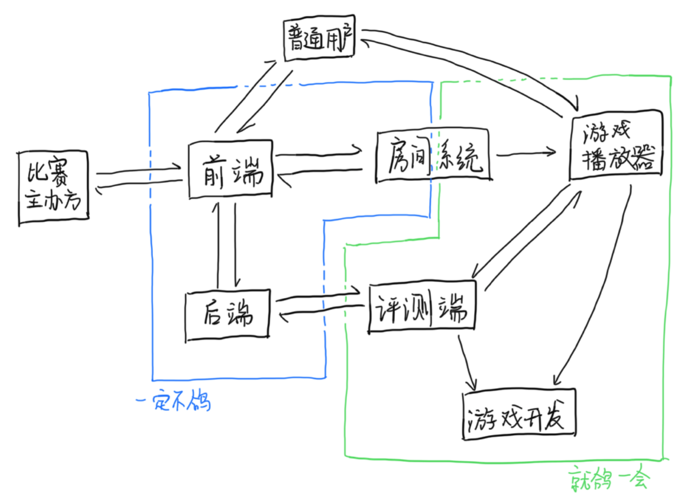

## 平台架构

Saiblo 的平台架构图大致如下：

各个模块的功能简要介绍如下

- 前端：Saiblo 平台前端，提供网站前端
- 后端：Saiblo 平台后端，提供网站后端 API，与测评机建立连接，进行测评任务的调度
- 评测端：Saiblo 平台评测端，负责编译用户 AI、评测用户对局、房间系统服务器
- 游戏播放器：Saiblo 平台上的单个游戏可以拥有播放器，播放器将s用于回放对局、在线游玩、观战

关于各个模块的详细介绍，请参考「开发手册」的对应部分。关于游戏播放器的细节，请参考「游戏开发者手册」对应部分。