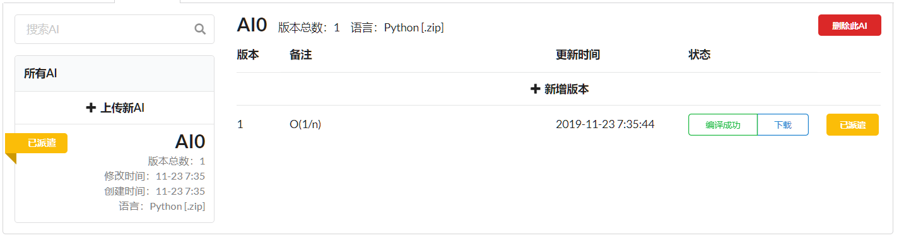
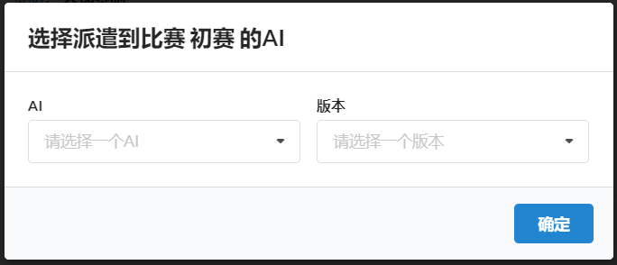

# 网站前端-部件

[TOC]

## aiList.vue

| 参数 | 值                    |
| ---- | --------------------- |
| 用途 | 管理提交的代码        |
| 预览 |  |

| 传入参数    | 解释                                |
| ----------- | ----------------------------------- |
| gameId      | 代码管理的是所有与 gameId 有关的 AI |
| allowRemote | 是否允许远端算力                    |

| 属性                  | 解释                                                                          |
| --------------------- | ----------------------------------------------------------------------------- |
| language              | 所有支持的语言，用于实现下拉菜单                                              |
| entity_info           | 在选中某个 entity 之后，右侧部分显示的内容数据来源于 entity_info              |
| entities              | 该用户所有的代码分支，在 mounted 中获取                                       |
| new_entity_modal      | 点击创建新分支时会弹出表格弹窗，表格弹窗的数据绑定到这里                      |
| new_version_modal     | 点击在某分支中创建新版本时会弹出表格弹窗，数据绑定到这里                      |
| compile_message_modal | 点击编译后的代码（编译成功/编译失败）弹出弹窗显示编译信息，弹窗数据绑定到这里 |
| active                | 派遣的 AI，在 mounted 中获取                                                  |
| entity_search_text    | 搜索 AI 的搜索栏关键字绑定到这里                                              |

| 函数                                    | 参数                                          | 返回值   | 解释                                                                                                               |
| --------------------------------------- | --------------------------------------------- | -------- | ------------------------------------------------------------------------------------------------------------------ |
| init_websocket                          | null                                          | null     | 初始化与评测端连接的 Websocket                                                                                     |
| websocket_on_message                    | event                                         | null     | 在 Websocket 收到消息之后的处理函数                                                                                |
| send_current_state                      | null                                          | null     | yyt                                                                                                                |
| show_compile_message                    | 编译信息与编译状态                            | null     | 弹出显示编译信息的弹窗                                                                                             |
| select                                  | 选中的分支的编号                              | null     | 根据分支编号向服务器请求详细信息，并绑定到 entity_info 上显示                                                      |
| change_new_file/change_new_version_file | null                                          | null     | 判断更换代码文件后文件大小是否不为 0                                                                               |
| requireFile                             | 分支，版本                                    | 判定结果 | 在分支不使用远程算力且未指定代码文件时需要文件                                                                     |
| isRegularWS                             |                                               |          | 判断是否为正确的 Websocket 地址                                                                                    |
| requireWSAddr                           |                                               |          |                                                                                                                    |
| requireFOW                              |                                               |          |                                                                                                                    |
| entityRequire                           |                                               |          |                                                                                                                    |
| codeRequire                             |                                               |          |                                                                                                                    |
| submit_new_entity_and_version           | null                                          | null     | 点击上传新 AI 时会首先执行创建一个新的分支，成功后执行创建一个新的代码版本，创建代码版本时需要对提交的表格进行验证 |
| submit_new_version                      | null                                          | null     | 在已经创建好的代码分支上创建一个新的代码版本                                                                       |
| delete_current_entity                   | null                                          | null     | 点击删除此 AI 时调用，删除当前的代码分支                                                                           |
| send                                    | 代码分支，版本号，派遣/取消派遣，代码版本对象 | null     | 改变派遣的版本                                                                                                     |
| download_code                           | 代码版本的下载链接                            | null     | 根据服务器给的链接下载代码文件                                                                                     |
| getLanguage                             | 代码分支                                      | null     | 根据代码分支中语言的键返回编程语言的字符表示                                                                       |

## codeSelector.vue

| 参数 | 值                          |
| ---- | --------------------------- |
| 用途 | 管理提交的代码              |
| 预览 |  |

| 传入参数       | 解释                                |
| -------------- | ----------------------------------- |
| username       | 代码管理的是所有与 gameId 有关的 AI |
| gameId         | 是否允许远端算力                    |
| originEntity   |                                     |
| originEntities |                                     |
| header         |                                     |
| callback       |                                     |

| 属性           | 解释 |
| -------------- | ---- |
| initted        |      |
| open           |      |
| entities       |      |
| entity         |      |
| entity_options |      |
| code           |      |
| code_options   |      |
|                |      |

| 函数       | 参数 | 返回值 | 解释                    |
| ---------- | ---- | ------ | ----------------------- |
| getEntity  |      |        | 获取用户所选择的 Entity |
| getCode    |      |        | 获取用户所选择的 Code   |
| selectCode |      |        | 用户确认选择这份代码    |
