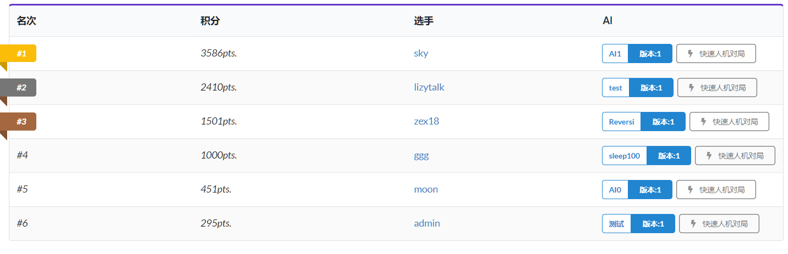
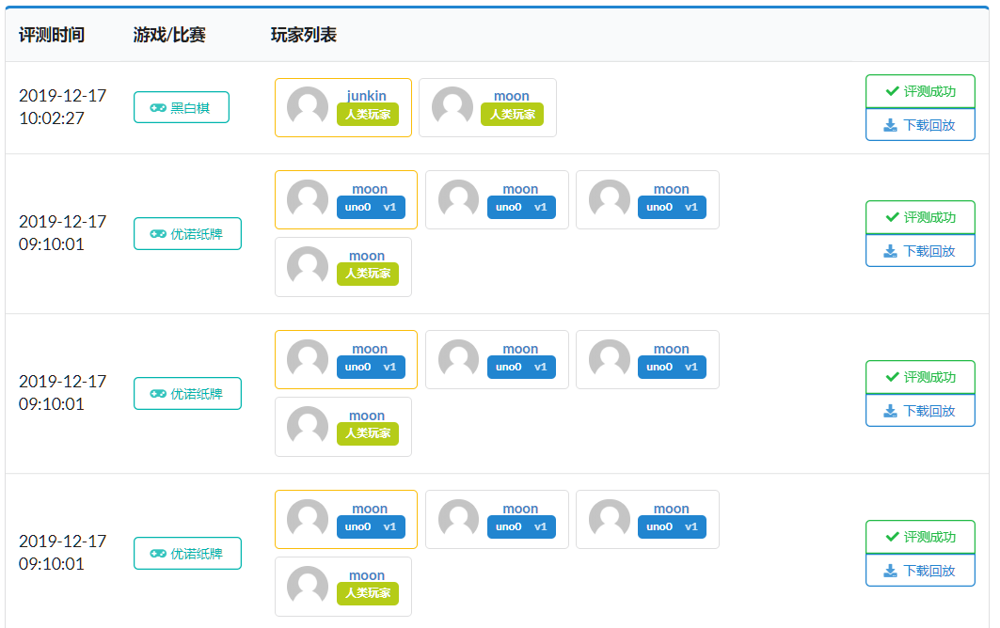

# 网站前端-部件

[TOC]

## aiList.vue

| 参数 | 值                    |
| ---- | --------------------- |
| 用途 | 管理提交的代码        |
| 预览 |  |

| 传入参数    | 解释                                |
| ----------- | ----------------------------------- |
| gameId      | 代码管理的是所有与 gameId 有关的 AI |
| allowRemote | 是否允许远端算力                    |

| 属性                  | 解释                                                                          |
| --------------------- | ----------------------------------------------------------------------------- |
| language              | 所有支持的语言，用于实现下拉菜单                                              |
| entity_info           | 在选中某个 entity 之后，右侧部分显示的内容数据来源于 entity_info              |
| entities              | 该用户所有的代码分支，在 mounted 中获取                                       |
| new_entity_modal      | 点击创建新分支时会弹出表格弹窗，表格弹窗的数据绑定到这里                      |
| new_version_modal     | 点击在某分支中创建新版本时会弹出表格弹窗，数据绑定到这里                      |
| compile_message_modal | 点击编译后的代码（编译成功/编译失败）弹出弹窗显示编译信息，弹窗数据绑定到这里 |
| active                | 派遣的 AI，在 mounted 中获取                                                  |
| entity_search_text    | 搜索 AI 的搜索栏关键字绑定到这里                                              |

| 函数                                    | 参数                                          | 返回值   | 解释                                                                                                               |
| --------------------------------------- | --------------------------------------------- | -------- | ------------------------------------------------------------------------------------------------------------------ |
| show_compile_message                    | 编译信息与编译状态                            | null     | 弹出显示编译信息的弹窗                                                                                             |
| select                                  | 选中的分支的编号                              | null     | 根据分支编号向服务器请求详细信息，并绑定到 entity_info 上显示                                                      |
| change_new_file/change_new_version_file | null                                          | null     | 判断更换代码文件后文件大小是否不为 0                                                                               |
| requireFile                             | 分支，版本                                    | 判定结果 | 在分支不使用远程算力且未指定代码文件时需要文件                                                                     |
| submit_new_entity_and_version           | null                                          | null     | 点击上传新 AI 时会首先执行创建一个新的分支，成功后执行创建一个新的代码版本，创建代码版本时需要对提交的表格进行验证 |
| submit_new_version                      | null                                          | null     | 在已经创建好的代码分支上创建一个新的代码版本                                                                       |
| delete_current_entity                   | null                                          | null     | 点击删除此 AI 时调用，删除当前的代码分支                                                                           |
| send                                    | 代码分支，版本号，派遣/取消派遣，代码版本对象 | null     | 改变派遣的版本                                                                                                     |
| download_code                           | 代码版本的下载链接                            | null     | 根据服务器给的链接下载代码文件                                                                                     |
| getLanguage                             | 代码分支                                      | null     | 根据代码分支中语言的键返回编程语言的字符表示                                                                       |

## ranklist.vue

| 参数 | 值                     |
| ---- | ---------------------- |
| 用途 | 显示排行榜             |
| 预览 |  |

| 传入参数 | 解释                   |
| -------- | ---------------------- |
| players  | 排行榜中每名玩家的信息 |
| game     | 排行榜对应的游戏       |

| 属性 | 解释 |
| ---- | ---- |
|      |      |

| 函数      | 参数  | 返回值 | 解释                                            |
| --------- | ----- | ------ | ----------------------------------------------- |
| copyToken | token | null   | 点击复制 token 的实现                           |
| startGame | token | null   | 根据选中的排行榜上玩家的 token 快速开始人机对局 |

## playerCard.vue

| 参数 | 值                                                   |
| ---- | ---------------------------------------------------- |
| 用途 | 显示用户头像（原本设计是显示带悬浮窗的头像，已舍弃） |
| 预览 |                             |

| 传入参数 | 解释   |
| -------- | ------ |
| username | 用户名 |

| 属性 | 解释 |
| ---- | ---- |
|      |      |

| 函数 | 参数 | 返回值 | 解释 |
| ---- | ---- | ------ | ---- |
|      |      |

## matchList.vue

| 参数 | 值                       |
| ---- | ------------------------ |
| 用途 | 显示所有对局             |
| 预览 |  |

| 传入参数  | 解释                            |
| --------- | ------------------------------- |
| contestId | 显示与 contestId 比赛有关的对局 |
| gameId    | 显示与 gameId 游戏有关的对局    |
| userName  | 显示与 userName 用户有关的对局  |

| 属性              | 解释                                                 |
| ----------------- | ---------------------------------------------------- |
| search_match_user | 搜索框的文本绑定到这里，用来搜索与该关键字有关的对局 |
| matches           | 直接从服务器获得到的所有对局                         |
| listOffset        | 对局需要分页，地址偏移量                             |
| nextLink          | 下一页的链接                                         |
| previousLink      | 上一页的链接                                         |
| pageLimit         | 单页的容量                                           |

| 函数             | 参数               | 返回值               | 解释                                                      |
| ---------------- | ------------------ | -------------------- | --------------------------------------------------------- |
| filtered_methods | null               | 筛选后的对局         | 显示的对局为 matches 经过 search_match_user 筛选后的结果  |
| truncate         | 字符串，长度       | 截断后的字符串       | 对字符串截断                                              |
| beautify_time    | 表示时间的字符串   | 格式化后的时间字符串 | 对时间字符串格式化                                        |
| turnPage         | 新的对局编号偏移量 | null                 | 对局列表翻页到新的偏移量的位置上                          |
| refreshMatchList | null               | null                 | 刷新对局列表，用于初始化的时候（和定时刷新，已废弃）      |
| downloadReplay   | url                | null                 | 根据服务器传给前端的 url 来下载录像文件，点击下载回放调用 |

## groupNoticeEditor.vue

| 参数 | 值                                |
| ---- | --------------------------------- |
| 用途 | 显示所有对局                      |
| 预览 |  |

| 传入参数 | 解释     |
| -------- | -------- |
| id       | 小组编号 |

| 属性          | 解释                                                           |
| ------------- | -------------------------------------------------------------- |
| notices       | 所有的通知，在 mounted 中获取值                                |
| notice_editor | 点击编辑公告或是新增公告会弹出表单弹窗，弹窗中的数据绑定到这里 |

| 函数   | 参数          | 返回值 | 解释                           |
| ------ | ------------- | ------ | ------------------------------ |
| submit | null          | null   | 将修改或是新增公告的表单提交   |
| erase  | 删除公告的 id | null   | 根据公告的 id 删除指定一条公告 |

## codeSelector.vue

| 参数 | 值                          |
| ---- | --------------------------- |
| 用途 | 管理提交的代码              |
| 预览 |  |

| 传入参数       | 解释                               |
| -------------- | ---------------------------------- |
| username       | 选择 AI 的用户的用户名             |
| gameId         | 所要选择的 AI 所属的游戏的编号     |
| originEntity   | AI 的原始 entity                   |
| originEntities | 可以选择的 AI 的原始列表           |
| header         | 组件显示的 header                  |
| callback       | 用户选择完 AI 后需要调用的回调函数 |

| 属性           | 解释                                             |
| -------------- | ------------------------------------------------ |
| initted        | 判断这个组件是否已经被初始化过了，避免重复初始化 |
| open           | 指示组件是否显示                                 |
| entities       | 可供选择的 entity 列表                           |
| entity         | 用户所选择的 entity 编号                         |
| entity_options | 所有 entity 的选项                               |
| code           | 用户所选择的 code 编号                           |
| code_options   | 所有 code 的选项                                 |

| 函数       | 参数      | 返回值 | 解释                                     |
| ---------- | --------- | ------ | ---------------------------------------- |
| getEntity  | entity_id | entity | 获取用户所选择的 Entity                  |
| getCode    | code_id   | code   | 获取用户所选择的 Code                    |
| selectCode | null      | null   | 用户确认选择这份代码，并调用回调函数处理 |
